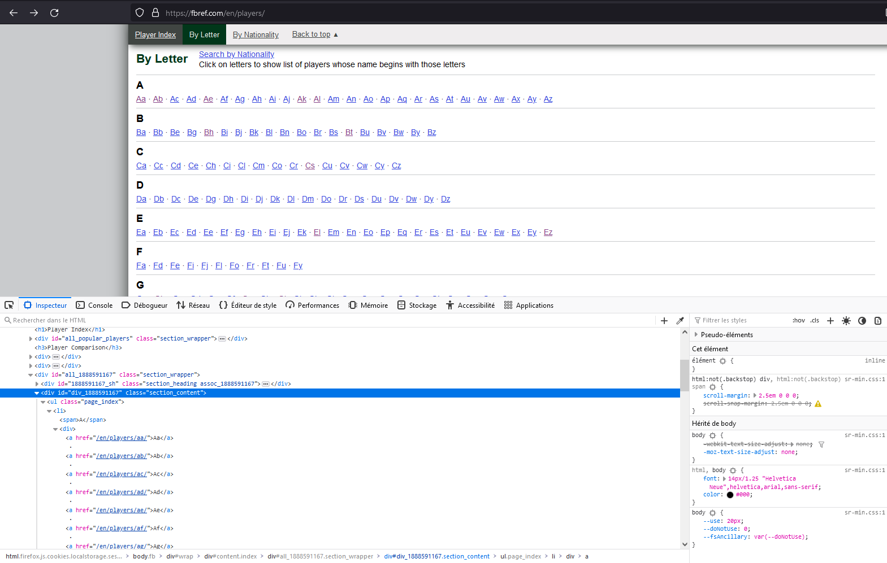

Repository inclut dans le cadre du projet "Formation Capgemini"

Vous trouverez donc différents fichiers csv faisant partis de la base de données.
* Joueur.csv contenant les joueurs ayant signé en 2022 ainsi que leur id sur le site
* StatistiquesGene.csv contenant énormémement d'informations sur les joueurs précédent sur chacune de leurs saisons.
* StatistiquesPerso.csv contenant les informations plus personnel des joueurs pris en compte

Détails rapide des fichiers pythons :
* fonctionnel.py : fonctions annexes utiles à la récupération de données précises
* tableau.py : fonctions récupérant les informations de chacun des 9 tableaux
* url.py qui : fonctions en rapport avec la récupération de l'url de chaque joueur
* caracteristique.py : fonctions pour récupérer les informations personelles
* main.py : fonction principale qui retourne le dataFrame final. Temps approximatif : 800min

A noter, une sécurité du site Fbref est de randomiser l'id de la division contenant les initiales. Il faut donc le mettre à jour avant de scrapper.

